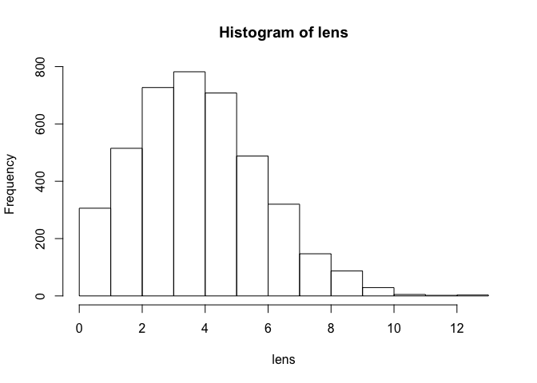

<!-- README.md is generated from README.Rmd. Please edit that file -->
``` r
library(hashsize)

# Load the tidyverse to populate the symbol table
suppressPackageStartupMessages(library(tidyverse))

buckets <- .Call(hashsize:::hashsize_symbols)
lens <- lengths(buckets)
total <- sum(lens)
total
#> [1] 21283
summary(lens)
#>    Min. 1st Qu.  Median    Mean 3rd Qu.    Max. 
#>   0.000   4.000   5.000   5.167   7.000  15.000
hist(lens)
```



``` r

largest_bucket <- symbols[lengths(symbols) == max(lengths(symbols))][[1]]

largest_bucket <- symbols[lengths(symbols) >= 10]

elapsed_time <- function(expr) system.time(expr)[[3]]

time_large_bucket <- function(buckets, n, median, times = 1e8) {
  b <- buckets[lengths(buckets) >= n]
  b <- b[[sample.int(length(b), 1)]]

  front <- as.character(b[[1]])
  back <- as.character(b[[length(b)]])
  med <- as.character(b[[median]])
  list(
    bucket_length = length(b),
    front_name = front,
    front = elapsed_time(.Call(hashsize:::hashsize_lookup_bench, front, times)),
    back_name = back,
    back = elapsed_time(.Call(hashsize:::hashsize_lookup_bench, back, times)),
    med_name = med,
    med = elapsed_time(.Call(hashsize:::hashsize_lookup_bench, med, times)))
}

to_df <- function(x) {
  df <- do.call(rbind.data.frame, x)

  percent <- function(x) sprintf("%.2f%%", x * 100)

  df$total <- percent((df$back - df$front) / df$front)
  df$median <- percent((df$med - df$front) / df$front)
  df
}

knitr::kable(
  to_df(replicate(50, time_large_bucket(buckets, 10, 5, 1e6), simplify = FALSE)))
```

|     |  bucket\_length| front\_name                             |  front| back\_name                |   back| med\_name                       |    med| total   | median  |
|-----|---------------:|:----------------------------------------|------:|:--------------------------|------:|:--------------------------------|------:|:--------|:--------|
| 2   |              10| qs                                      |  0.014| sys.parent                |  0.048| strip.white                     |  0.037| 242.86% | 164.29% |
| 210 |              12| R\_total\_handles                       |  0.033| enquote                   |  0.055| .\_\_T\_\_sqlData:DBI           |  0.042| 66.67%  | 27.27%  |
| 3   |              10| augment.glmRob                          |  0.032| memory.profile            |  0.060| .midDend                        |  0.036| 87.50%  | 12.50%  |
| 4   |              11| hashsize\_symbol\_table                 |  0.044| file.show                 |  0.053| $.output\_handler               |  0.044| 20.45%  | -0.00%  |
| 5   |              12| ic.infer                                |  0.019| validate\_formulas        |  0.072| mpg                             |  0.024| 278.95% | 26.32%  |
| 6   |              10| check\_names\_before\_after.default     |  0.053| .MakeImplicitGroupMembers |  0.074| .get\_S4\_generics              |  0.039| 39.62%  | -26.42% |
| 7   |              10| parse\_time                             |  0.024| ..33                      |  0.048| .check\_packages                |  0.042| 100.00% | 75.00%  |
| 8   |              10| GeomLine                                |  0.021| xtfrm.POSIXlt             |  0.051| DUMMY                           |  0.026| 142.86% | 23.81%  |
| 9   |              11| durs                                    |  0.015| deletions                 |  0.050| bgcodes                         |  0.028| 233.33% | 86.67%  |
| 10  |              10| te                                      |  0.017| qnf                       |  0.045| C\_stri\_enc\_set               |  0.039| 164.71% | 129.41% |
| 11  |              12| set\_sliced\_env                        |  0.031| .Group                    |  0.057| stri\_read\_raw                 |  0.038| 83.87%  | 22.58%  |
| 12  |              12| Period                                  |  0.016| as.Date.default           |  0.069| select\_.data.frame             |  0.042| 331.25% | 162.50% |
| 13  |              10| fortify.default                         |  0.029| ans                       |  0.044| .\_\_T\_\_remote\_remove:git2r  |  0.053| 51.72%  | 82.76%  |
| 14  |              10| fortify.default                         |  0.028| ans                       |  0.042| .\_\_T\_\_remote\_remove:git2r  |  0.055| 50.00%  | 96.43%  |
| 15  |              13| tidy.SpatialLinesDataFrame              |  0.044| rl\_word\_breaks          |  0.069| found\_src                      |  0.034| 56.82%  | -22.73% |
| 16  |              10| milliseconds                            |  0.027| getElement                |  0.049| stri\_trans\_nfd                |  0.038| 81.48%  | 40.74%  |
| 17  |              10| parser\_setMethodS3                     |  0.033| env::406                  |  0.045| sort\_                          |  0.026| 36.36%  | -21.21% |
| 18  |              10| augment.glmRob                          |  0.030| memory.profile            |  0.057| .midDend                        |  0.035| 90.00%  | 16.67%  |
| 19  |              13| commonmark                              |  0.022| .rowMeans                 |  0.056| tbl\_vars.tbl\_lazy             |  0.046| 154.55% | 109.09% |
| 20  |              12| dmicroseconds                           |  0.027| package\_coverage         |  0.066| Variogram                       |  0.036| 144.44% | 33.33%  |
| 21  |              11| freq1                                   |  0.016| comment&lt;-              |  0.056| call\_depth                     |  0.032| 250.00% | 100.00% |
| 22  |              10| qs                                      |  0.013| sys.parent                |  0.049| strip.white                     |  0.041| 276.92% | 215.38% |
| 23  |              12| package\_desc                           |  0.030| tolower                   |  0.055| format.PDF\_Indirect\_Reference |  0.062| 83.33%  | 106.67% |
| 24  |              12| Period                                  |  0.016| as.Date.default           |  0.073| select\_.data.frame             |  0.043| 356.25% | 168.75% |
| 25  |              12| bad\_vignettebuilder                    |  0.043| droplevels                |  0.058| geom\_step                      |  0.031| 34.88%  | -27.91% |
| 26  |              11| URL                                     |  0.014| as.data.frame.complex     |  0.059| statsBy.boot                    |  0.036| 321.43% | 157.14% |
| 27  |              10| nvars                                   |  0.016| .tryResumeInterrupt       |  0.061| 5                               |  0.023| 281.25% | 43.75%  |
| 28  |              12| Hmisc                                   |  0.016| package.lib               |  0.060| residuals.gnls                  |  0.044| 275.00% | 175.00% |
| 29  |              15| Geom                                    |  0.017| sort.list                 |  0.065| .GridEvalEnv                    |  0.037| 282.35% | 117.65% |
| 30  |              11| .Last.lib                               |  0.025| standardGeneric           |  0.059| gh\_pkgs                        |  0.028| 136.00% | 12.00%  |
| 31  |              11| reclass\_date.Date                      |  0.032| sample                    |  0.047| stri\_endswith\_fixed           |  0.046| 46.87%  | 43.75%  |
| 32  |              12| lzw+p                                   |  0.019| update\_packages          |  0.058| scale\_x\_sqrt                  |  0.035| 205.26% | 84.21%  |
| 33  |              10| sloti                                   |  0.016| getExtends                |  0.050| grid.xaxis                      |  0.037| 212.50% | 131.25% |
| 34  |              11| .Last.lib                               |  0.020| standardGeneric           |  0.056| gh\_pkgs                        |  0.029| 180.00% | 45.00%  |
| 35  |              10| parser\_setMethodS3                     |  0.034| env::406                  |  0.047| sort\_                          |  0.025| 38.24%  | -26.47% |
| 36  |              12| Period                                  |  0.020| as.Date.default           |  0.071| select\_.data.frame             |  0.046| 255.00% | 130.00% |
| 37  |              11| round.table                             |  0.024| saveToConn                |  0.054| calculateGridLayout             |  0.044| 125.00% | 83.33%  |
| 38  |              10| sloti                                   |  0.015| getExtends                |  0.054| grid.xaxis                      |  0.036| 260.00% | 140.00% |
| 39  |              11| match\_data\_from\_pos\_and\_len        |  0.048| dynGet                    |  0.052| dbDisconnect                    |  0.042| 8.33%   | -12.50% |
| 40  |              15| Geom                                    |  0.015| sort.list                 |  0.062| .GridEvalEnv                    |  0.034| 313.33% | 126.67% |
| 41  |              10| length.Rd                               |  0.021| \[.numeric\_version       |  0.058| notifyLocalFun                  |  0.038| 176.19% | 80.95%  |
| 42  |              10| tidy.fitdistr                           |  0.029| env::206                  |  0.048| find\_index\_check              |  0.040| 65.52%  | 37.93%  |
| 43  |              11| bad\_authors\_at\_R\_field\_for\_author |  0.060| bounds                    |  0.047| pdConstruct.pdCompSymm          |  0.050| -21.67% | -16.67% |
| 44  |              12| node\_comment\_new                      |  0.030| env::150                  |  0.052| flattenListing                  |  0.038| 73.33%  | 26.67%  |
| 45  |              10| roclet\_output.roclet\_rd               |  0.040| dist                      |  0.042| coef.corNatural                 |  0.041| 5.00%   | 2.50%   |
| 46  |              11| set\_partition\_order                   |  0.037| .Class                    |  0.053| page\_str                       |  0.029| 43.24%  | -21.62% |
| 47  |              10| curl\_fetch\_disk                       |  0.029| file.link                 |  0.047| lookup\_S4\_methods             |  0.040| 62.07%  | 37.93%  |
| 48  |              10| splusTimeSeries                         |  0.028| C\_qpois                  |  0.044| print.select\_query             |  0.044| 57.14%  | 57.14%  |
| 49  |              11| ElectoGraph                             |  0.023| .\_\_C\_\_hsearch         |  0.063| stri\_replace\_first\_charclass |  0.058| 173.91% | 152.17% |
| 50  |              10| classi                                  |  0.016| .External                 |  0.046| fetch\_source.bioc              |  0.041| 187.50% | 156.25% |
